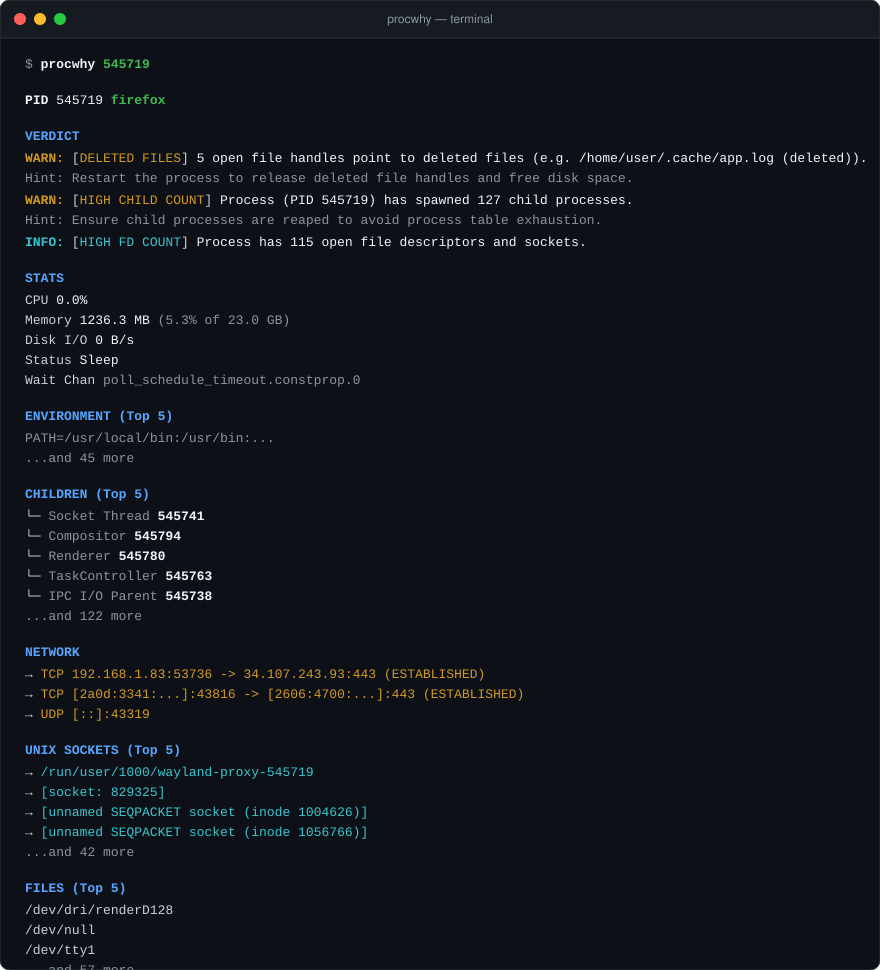

<p align="center">
  
</p>

# procwhy

**Surfaces what the OS can measure. You decide what it means.**

<p align="center">
  
  
  
  
  
  
  
</p>

`procwhy` is an opinionated process diagnostic CLI for incident response. It interrogates `/proc`, socket tables, and open file descriptors, evaluates heuristic rules, and reports what it finds — with explicit confidence levels — in **~14ms warm**.

Instead of dumping raw counters, `procwhy` gives you structured findings: what the OS measured, why it is operationally interesting, and a concrete next step. It does not pretend to know the root cause. That judgment belongs to the operator.

<p align="center">
  
</p>

## Why procwhy?

`ps`, `top`, `lsof`, and `ss` each show one slice of the picture.
`procwhy` brings those slices together and tells you what questions to ask next.

## 5 Incidents procwhy Can Diagnose in Seconds

### 1. "Disk is 100% full but `du` shows nothing"

You delete log files. `df` still says full. `du` shows nothing. The space is gone but the disk won't release it.

**What's happening:** a running process still holds an open file descriptor to the deleted file. The kernel keeps the blocks allocated until that descriptor closes.

```bash
$ procwhy nginx

HEALTH  WARN

WARN: [DELETED FILES]  [CONFIRMED]
  Observation:    3 deleted file descriptor(s) held open (11.2 GB allocated on disk).
  Evidence:       3 deleted file descriptors
                  Total disk space held: 11.2 GB
                  Largest deleted file: /var/log/nginx/access.log (8.7 GB)
  Interpretation: Filesystem space remains allocated and cannot be reclaimed
                  until those descriptors close.
  Recommendation: Restart or signal the process to release deleted file handles
                  and free disk space.
```

**Diagnosis: 4 seconds.** `nginx -s reopen` or a graceful restart frees 11 GB instantly.

---

### 2. "`kill -9` does nothing — the process is unkillable"

The process hangs. You escalate to `kill -9`. Nothing. The process is still there minutes later.

**What's happening:** the process is in D-state — `TASK_UNINTERRUPTIBLE` — blocked inside a kernel driver waiting for I/O that will never come back. The kernel defers all signals, including `SIGKILL`, until the blocking syscall returns.

```bash
$ procwhy worker

HEALTH  CRITICAL

CRITICAL: [D-STATE HANG]  [CONFIRMED]
  Observation:    Process is in Uninterruptible Sleep (D-state) on kernel
                  wait channel 'nfs_wait_client'.
  Evidence:       Scheduler state: TASK_UNINTERRUPTIBLE (D)
                  Kernel wait channel (wchan): nfs_wait_client
  Interpretation: Process is blocked inside a kernel driver or storage I/O
                  operation. POSIX signals (including SIGKILL) are deferred
                  until the kernel I/O request unblocks.
  Recommendation: Inspect storage subsystem, hung NFS mounts, or kernel
                  dmesg logs for storage/driver timeouts.
```

**Diagnosis: 4 seconds.** Stop looking at the process — look at the NFS mount.

---

### 3. "Something is using port 8080 and my deployment is failing"

Your deploy fails with `EADDRINUSE`. You have no idea what is holding the port.

```bash
$ procwhy :8080

PORT :8080 ─> node (PID 4812)  node /srv/api/server.js

HEALTH  WARN

WARN: [PUBLIC LISTENER]  [POSSIBLE]
  Observation:    Process is bound to wildcard interface: TCP 0.0.0.0:8080 (LISTEN)
  Evidence:       Listener bind: TCP 0.0.0.0:8080 (LISTEN)
  Interpretation: This socket accepts connections on all network interfaces.
                  For many services this is intentional and correct. Whether it
                  represents a risk depends on firewall rules and network topology.
  Recommendation: Confirm the service is intended to be publicly reachable.
                  If not, bind to 127.0.0.1 or a specific interface instead.
```

**Diagnosis: 4 seconds.** Port owned by `node` PID 4812 — a previous deploy left a process running.

---

### 4. "We have zombie processes piling up"

`ps aux` shows dozens of `<defunct>` processes. They can't be killed. Over time they exhaust your PID table.

**What's happening:** the parent process is not calling `waitpid()` to reap terminated children. Until it does, the kernel keeps the process descriptor alive.

```bash
$ procwhy 7341

HEALTH  CRITICAL

CRITICAL: [ZOMBIE PROCESS]  [CONFIRMED]
  Observation:    Defunct process. It has terminated but parent PID 7302 has not
                  reaped its exit status via waitpid().
  Evidence:       Scheduler state: Zombie
                  Parent: parent PID 7302
  Interpretation: The process descriptor remains allocated in the kernel process
                  table until reaped by its parent.
  Recommendation: Signal parent PID 7302 or restart the parent to reap
                  terminated child processes.
```

**Diagnosis: 4 seconds.** The parent (PID 7302) has a bug — it spawns children but never reaps them. Fix the parent, not the zombies.

---

### 5. "The server got OOM-killed overnight — find out who"

You wake up to a dead service. The OOM killer struck. You need to know which process was responsible before it happens again.

```bash
$ procwhy myservice

HEALTH  WARN

WARN: [HIGH MEMORY PRESSURE]  [LIKELY]
  Observation:    Resident memory is 6140.3 MB (38.4% of 16.0 GB host RAM).
  Evidence:       Resident memory (RSS): 6140.3 MB
                  Host RAM share: 38.4%
                  Total host RAM: 16.0 GB
                  Note: cgroup limits, swap, and overcommit are not accounted for here.
  Interpretation: RSS accounts for a substantial portion of visible host RAM.
                  Whether this causes an OOM event depends on swap availability,
                  cgroup memory limits, and kernel overcommit policy.
  Recommendation: Verify memory growth trend, check cgroup memory limits
                  (memory.max), and inspect swap usage before concluding the
                  process is at OOM risk.

SUMMARY
  Process is consuming a large portion of host RAM (verify cgroup limits and swap).
```

**Diagnosis: 4 seconds.** 6 GB RSS and growing — check `memory.max` in the cgroup and compare against swap. You now have the right questions to ask.

---


## The Diagnostic Engine

Trust is the entire product. `procwhy` grounds every finding in a strict 4-part architecture:

1. **Observation**: Something directly measured from the OS.
2. **Evidence**: The concrete metrics and state that triggered the rule.
3. **Interpretation**: What the evidence most likely indicates — stated without overclaiming.
4. **Recommendation**: A practical next step for the operator.

### Confidence Model

Every finding carries an explicit confidence level. These are ordinal, not probabilistic — `procwhy` does not invent Bayesian scores.

| Level | Semantics |
|-------|-----------|
| **`[CONFIRMED]`** | Directly verifiable OS state. The kernel reports this unambiguously (e.g. zombie status, D-state, unlinked file descriptor still holding disk). |
| **`[LIKELY]`** | Strong inference supported by telemetry, but with acknowledged caveats (e.g. high RSS relative to host RAM — actual OOM risk also depends on swap and cgroup limits not measured here). |
| **`[POSSIBLE]`** | Operationally interesting observation that requires operator judgment. Many `[POSSIBLE]` findings describe normal, intentional behaviour (e.g. a service bound to `0.0.0.0` is often correct). The tool surfaces the observation; you decide whether it is a problem. |

```text
DIAGNOSTICS
  WARN: [DELETED FILES]  [CONFIRMED]
    Observation:    5 deleted file descriptor(s) held open (4.2 GB allocated on disk).
    Evidence:       5 deleted file descriptors | Total disk space held: 4.2 GB | Largest: /var/log/app.log (4.2 GB)
    Interpretation: Filesystem space remains allocated and cannot be reclaimed until those descriptors close.
    Recommendation: Restart or signal the process to release deleted file handles and free disk space.

  WARN: [CPU PEGGING]    [LIKELY]
    Observation:    97.8% CPU utilization over the sampling window.
    Evidence:       CPU: 97.8% | Scheduler state: Running | wchan: - | Sample duration: 200ms
    Interpretation: Sustained high CPU utilization observed during the sampling window. The process was
                    actively scheduled rather than waiting on I/O or a lock. Root cause cannot be
                    determined from scheduler metrics alone.
    Recommendation: Capture a stack profile (e.g. `perf top -p <pid>`) to identify the hot code path
                    before drawing conclusions.
```

## Supported Diagnostic Rules

| Rule | Confidence | What it measures |
|------|-----------|-----------------|
| **Deleted File Leaks** | `[CONFIRMED]` | Unlinked files still held open by descriptors, with exact bytes that cannot be freed until the process releases them |
| **D-State Hang** | `[CONFIRMED]` | Process in `TASK_UNINTERRUPTIBLE` state; signals including `SIGKILL` are deferred until the kernel I/O unblocks |
| **Zombie Process** | `[CONFIRMED]` | Terminated child not yet reaped by its parent via `waitpid()` |
| **Privileged Port** | `[CONFIRMED]` | Process bound to a reserved port below 1024 at listen time |
| **CPU Pegging** | `[LIKELY]` | >90% CPU utilization over a 200ms sampling window; root cause requires a stack profile |
| **High Memory Pressure** | `[LIKELY]` | RSS exceeds 50% of visible host RAM — note: actual OOM risk also depends on swap, cgroup limits, overcommit policy, and page-cache reclaim, none of which are measured here |
| **High RAM** | `[LIKELY]` | RSS between 20–50% of visible host RAM |
| **Disk Thrashing** | `[LIKELY]` | >20 MB/s I/O throughput delta over a 200ms window (charge bytes, not physical bandwidth) |
| **Public Listener** | `[POSSIBLE]` | Socket bound to `0.0.0.0` or `[::]` — often intentional; operator judgment required |
| **High TCP Connections** | `[POSSIBLE]` | >10 external TCP connections — normal for proxies and pooling services |
| **Credential Masking** | — | Redacts API tokens, bearer keys, and database passwords from environment variable output |

## Usage

```bash
# Inspect by PID
procwhy 1234

# Inspect the process listening on a port
procwhy :8080
procwhy --port 3000

# Inspect by process name
procwhy node
procwhy firefox

# Run latency benchmark
procwhy --benchmark

# Output structured JSON for automation or jq
procwhy --json :8080
procwhy --json 1234 | jq '.diagnostics'

# Show all items without truncation
procwhy -a 1234
procwhy --all node

# Disable automatic pager
procwhy --no-pager 1234
```

### Performance

`procwhy` is built to be fast enough to run interactively during active incidents:

```bash
$ procwhy --benchmark
Running procwhy latency benchmark...

Cold startup: 63.6ms
Warm (p50):   14.2ms
Warm (p95):   20.9ms
```

Typical warm execution completes in ~14ms; designed for <500ms interactive incident diagnostics.

### JSON Automation

Use `--json` to integrate `procwhy` into monitoring agents, alerting pipelines, or incident automation:

```json
{
  "procwhy_version": "1.0.0",
  "pid": 4812,
  "name": "node",
  "health": "warning",
  "summary": "Process is consuming unusually high CPU and holding open file handles to deleted files.",
  "identity": {
    "binary": "/usr/bin/node",
    "user": "app (UID 1000)",
    "cwd": "/srv/api",
    "uptime_seconds": 13320,
    "uptime_human": "3h 42m"
  },
  "diagnostics": [
    {
      "category": "DELETED FILES",
      "severity": "warning",
      "confidence": "confirmed",
      "observation": "5 deleted file descriptor(s) held open (4.2 GB allocated on disk).",
      "evidence": [
        "5 deleted file descriptors",
        "Total disk space held: 4.2 GB",
        "Largest deleted file: /var/log/app.log (4.2 GB)"
      ],
      "interpretation": "Filesystem space remains allocated and cannot be reclaimed until those descriptors close.",
      "recommendation": "Restart or signal the process to release deleted file handles and free disk space."
    }
  ]
}
```

## Installation

### Build from Source

```bash
# Clone the repository
git clone https://github.com/CtxtArc/procwhy.git
cd procwhy

# Install the binary locally
cargo install --path .
```

Or build the release binary directly:
```bash
cargo build --release
# Binary available at target/release/procwhy
```

## License

[MIT](LICENSE)
